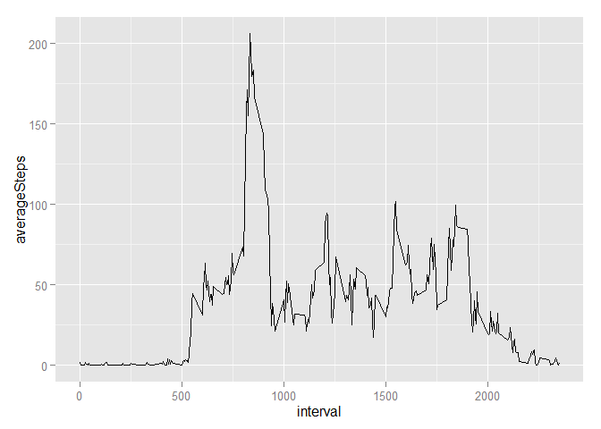
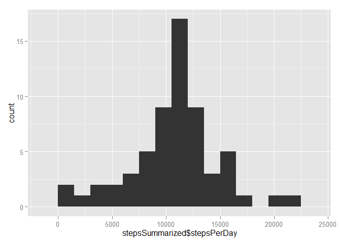
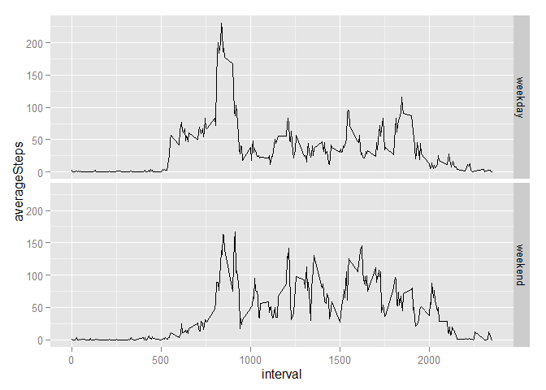

# Reproducible Research: Peer Assessment 1
## Requirements for project

```r
require(dplyr)
```

```
## Loading required package: dplyr
## 
## Attaching package: 'dplyr'
## 
## The following object is masked from 'package:stats':
## 
##     filter
## 
## The following objects are masked from 'package:base':
## 
##     intersect, setdiff, setequal, union
```

```r
require(ggplot2)
```

```
## Loading required package: ggplot2
```

```r
require(lubridate)
```

```
## Loading required package: lubridate
```
## Loading and preprocessing the data


```r
unzip("activity.zip",files = "activity.csv")
activities <- read.csv("activity.csv",header = TRUE, colClasses = c("numeric","character","numeric"))
activities$date <- as.Date(activities$date)
```

## What is mean total number of steps taken per day?

Histogram of steps per day:

```r
groupedActivities <- group_by(activities, date)
stepsPerDay <- summarise(groupedActivities, stepsPerDay = sum(steps,na.rm = TRUE))
qplot(stepsPerDay$stepsPerDay, binwidth=1500)
```

 

Mean and median of total steps per day:

```r
mean(stepsPerDay$stepsPerDay)
```

```
## [1] 9354.23
```

```r
median(stepsPerDay$stepsPerDay)
```

```
## [1] 10395
```

## What is the average daily activity pattern?
Timeseries over the intervals, with the average number of steps over days

```r
groupedInterval <- group_by(activities,interval)
intervalSummary <- summarise(groupedInterval, averageSteps = mean(steps,na.rm= TRUE))
with(intervalSummary,qplot(x = interval, y = averageSteps, geom = "line"))
```

 

Maximum number of steps averaged over days


```r
intervalSummary[intervalSummary$averageSteps ==max(intervalSummary$averageSteps),1]$interval
```

```
## [1] 835
```

## Imputing missing values

Total number of NA's:

```r
sum(is.na(activities))
```

```
## [1] 2304
```

Show summary of complete table:

```r
summary(activities)
```

```
##      steps             date               interval     
##  Min.   :  0.00   Min.   :2012-10-01   Min.   :   0.0  
##  1st Qu.:  0.00   1st Qu.:2012-10-16   1st Qu.: 588.8  
##  Median :  0.00   Median :2012-10-31   Median :1177.5  
##  Mean   : 37.38   Mean   :2012-10-31   Mean   :1177.5  
##  3rd Qu.: 12.00   3rd Qu.:2012-11-15   3rd Qu.:1766.2  
##  Max.   :806.00   Max.   :2012-11-30   Max.   :2355.0  
##  NA's   :2304
```
This shows that only the steps column has missing values.

Imputing missing values with the mean value of that interval over the different days:

```r
activitiesImputed <- activities
activitiesImputed$meanSteps <- rep(round(intervalSummary$averageSteps),nrow(activitiesImputed)/nrow(intervalSummary))

activitiesImputed$steps <- ifelse(is.na(activitiesImputed$steps),activitiesImputed$meanSteps,activitiesImputed$steps)
```

Histogram of steps per day on imputed data:

```r
groupedActivities <- group_by(activitiesImputed, date)
stepsSummarized <- summarise(groupedActivities, stepsPerDay = sum(steps,na.rm = TRUE))
qplot(stepsSummarized$stepsPerDay, binwidth=1500)
```

 

Mean and median of total steps per day from imputed data:

```r
mean(stepsSummarized$stepsPerDay)
```

```
## [1] 10765.64
```

```r
median(stepsSummarized$stepsPerDay)
```

```
## [1] 10762
```

Absolute difference between original data and imputed data for the mean and median of total steps per day:

```r
abs(mean(stepsSummarized$stepsPerDay) - mean(stepsPerDay$stepsPerDay))
```

```
## [1] 1411.41
```

```r
abs(median(stepsSummarized$stepsPerDay) - median(stepsPerDay$stepsPerDay))
```

```
## [1] 367
```
There clearly is a difference between the original data and the imputed data. Especially the mean has increased a lot, and also moved towards the median more. This makes sense, since the median is a measure that is less sensitive to noise.

Next to this, you can see that the the histogram has a shape that resembles a normal distribution more than the histogram of the original data.

## Are there differences in activity patterns between weekdays and weekends?

```r
factorLevels <- c("weekday","weekend")
dayWeekendFactor <- factor(factorLevels,levels = factorLevels)
activitiesImputed$dayWeekend <- ifelse(wday(activitiesImputed$date) %in% c(1,7),levels(dayWeekendFactor)[2],levels(dayWeekendFactor)[1])
groupedInterval <- group_by(activitiesImputed,interval,dayWeekend)
intervalSummary <- summarise(groupedInterval, averageSteps = mean(steps,na.rm= TRUE))
plot <- ggplot(intervalSummary,aes(x = interval, y = averageSteps)) + geom_line()
plot + facet_grid(dayWeekend ~ .)
```

 
